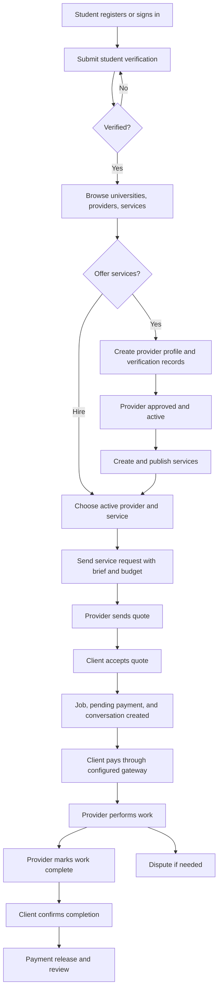
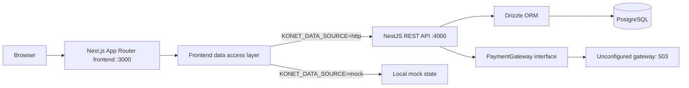
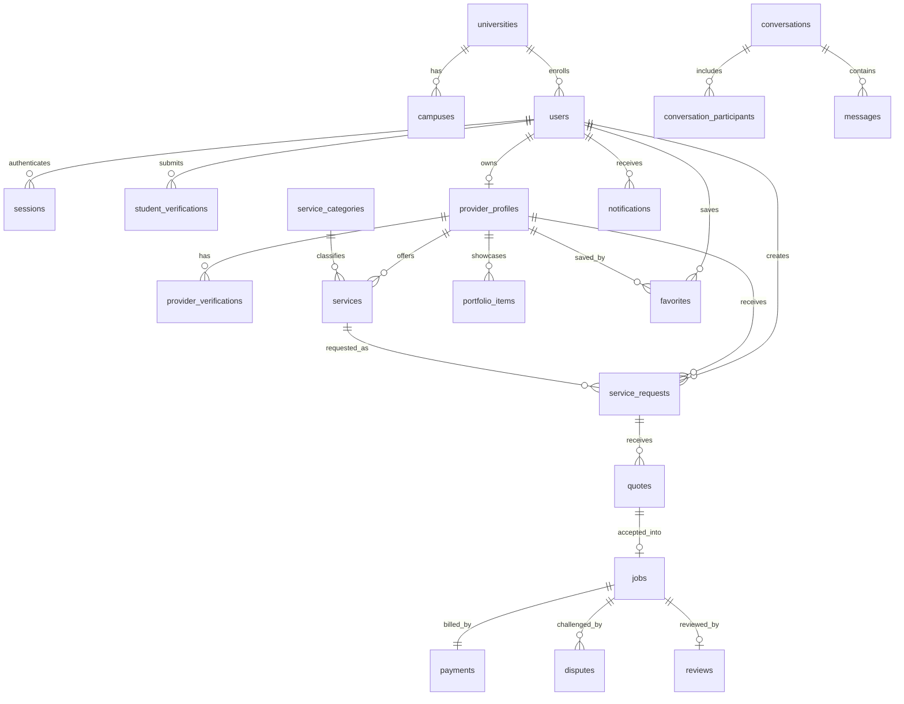
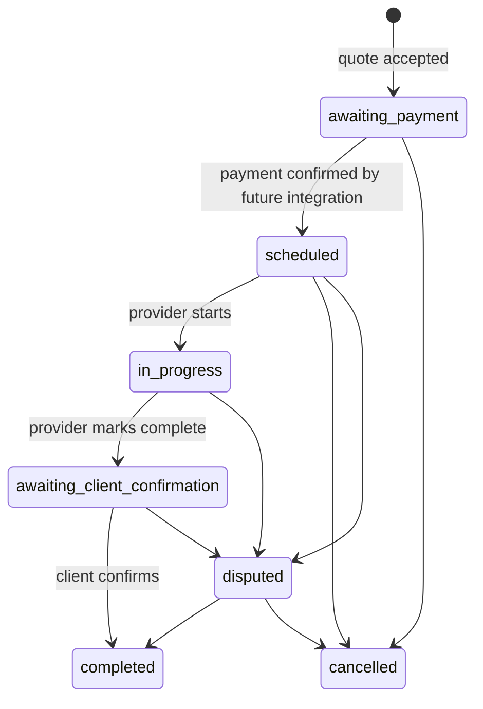

# Konet

Konet is a student service marketplace. A student can discover another student's services, send a brief, receive a quote, hire the provider, discuss the job, confirm delivery, and review the work. Providers can build a profile, publish services, respond to requests, and manage jobs. The product is designed around university identity, provider trust, and protected payments.

> **Current state:** This repository contains a working API foundation and a largely prototype frontend. The frontend uses a shared mock data source for app screens and most actions, with a central switch for future HTTP integration. It does not yet persist these actions through the backend API. The API's payment gateway is deliberately unconfigured, so no real payment is collected or held. Treat the diagrams below as the intended end-to-end product flow, with implementation status called out in [Current implementation and gaps](#current-implementation-and-gaps).

## Contents

- [Product roles and workflow](#product-roles-and-workflow)
- [System architecture](#system-architecture)
- [Frontend](#frontend)
- [Backend and API](#backend-and-api)
- [Planned stack and requirements](#planned-stack-and-requirements)
- [Database schema](#database-schema)
- [State and payment rules](#state-and-payment-rules)
- [Local setup](#local-setup)
- [Current implementation and gaps](#current-implementation-and-gaps)
- [Where to change things](#where-to-change-things)

## Product roles and workflow

A **client** is a verified student hiring someone. A **provider** is a verified student with a provider profile and services. The same account may play both roles. Provider verification has separate identity, work, and CAC dimensions; a provider profile must be active before services can be published through the API.



Typical client journey:

1. Register with a university and campus, sign in, and submit student verification. API hiring requires `studentVerificationStatus = verified`.
2. Search active providers or browse active services. Review profile, service, verification dimensions, portfolio, and reputation.
3. Send a request for a specific active service and provider. The request carries a description, optional budget range, timing, and location.
4. Review the provider's quote, amount, scope, delivery date, notes, and expiry. Accepting an unexpired quote atomically creates a job, pending payment, and conversation.
5. Initialize payment when a real gateway is configured. The job then proceeds through scheduling, work, provider completion, client confirmation, and review. Either side can use the conversation; eligible jobs can enter a dispute flow.

Typical provider journey:

1. Complete student verification, create a provider profile, and submit the required verification evidence through the eventual review process.
2. Once approved and active, create services in categories and manage their status, price, and availability.
3. Receive a request, discuss requirements, send a quote, perform funded work, and mark it ready for client confirmation.
4. Track jobs, messages, reviews, and earnings.

## System architecture



The frontend and backend are separate npm projects in this repository. The frontend uses a same-origin Next route for browser queries and commands. `KONET_DATA_SOURCE=mock` is the working default; `http` selects the backend adapter. Only public catalog endpoint mappings are defined so far. Missing mappings fail explicitly, and the live authentication and payment contracts remain to be integrated. The API uses PostgreSQL as its source of truth.

### Stack

| Layer | Technology | Purpose |
| --- | --- | --- |
| Frontend | Next.js 16 App Router, React 19, TypeScript | Pages, layouts, server rendering, client forms |
| Styling | Tailwind CSS 4 and existing CSS | New shared controls and key screens use Tailwind utilities; legacy pages still use CSS |
| Frontend data and icons | Axios, TanStack React Query, Lucide React | Same-origin requests, cache updates, consistent icons |
| Backend | NestJS 11, TypeScript | Versioned REST API and modular domain services |
| Validation and API docs | class-validator, class-transformer, Swagger | DTO validation and `/api/docs` |
| Database | PostgreSQL 17, Drizzle ORM and migrations | Persistent records and constraints |
| Authentication | JWT, Argon2, rotating refresh cookie | API identity and sessions |
| Infrastructure | Docker Compose, Helmet, CORS, Pino | Local database, HTTP hardening, logging |
| Payment | Gateway interface with unconfigured implementation | Integration seam; real processing is pending |

## Frontend

`konet-frontend/src/app` uses route groups for marketing, authentication, and client screens, plus a separate `/provider` area. The route groups do not appear in URLs.

| Area | Main URLs | Purpose |
| --- | --- | --- |
| Marketing | `/`, `/about`, `/how-it-works`, `/for-providers`, legal/trust pages | Explain product and trust model |
| Account | `/sign-up`, `/sign-in`, `/forgot-password`, `/verify-student` | Demo account and verification flow |
| Discovery | `/discover`, `/providers/[providerId]` | Browse, search, filter, and evaluate providers; `/search` redirects to Discover |
| Hiring | `/requests/[requestId]`, `/quotes/[quoteId]`, `/checkout/[jobId]`, `/jobs`, `/jobs/[jobId]` | Request to job journey |
| Collaboration | `/messages`, `/messages/[conversationId]`, `/notifications`, `/reviews/[jobId]` | Messages, updates, feedback |
| Client profile | `/profile`, `/profile/verification`, `/settings` | Identity and preferences |
| Provider | `/provider/onboarding/*`, `/provider/dashboard`, `/provider/services/*`, `/provider/requests/*`, `/provider/portfolio`, `/provider/earnings`, `/provider/settings` | Provider setup and operations |

`src/data/access` contains typed query and command contracts, the in-memory mock adapter, the Axios HTTP adapter, validation, and the endpoint registry. `src/data/repositories` exposes server reads for pages. Browser actions call `src/app/api/frontend/route.ts` through `src/data/access/client.ts`; TanStack Query hooks live in `src/lib/query`. When backend endpoints are ready, complete `src/data/access/endpoints.ts` and set `KONET_DATA_SOURCE=http`. The `src/features` directory contains interactive forms and actions; `src/components` contains reusable layout and UI pieces.

`src/proxy.ts` redirects visitors away from protected client and provider pages based on demo cookies (`konet_session`, `konet_student_verified`, `konet_provider`). In mock mode these cookies are set at the same-origin data boundary; they are **not** the API's JWT authentication or authoritative verification state. Do not use them as proof of identity or payment in production.

## Backend and API

The NestJS app is assembled in `konet-backend/src/app.module.ts`. Controllers handle HTTP, services enforce domain rules, and the Drizzle schema lives under `src/database/schema`. All endpoints below are prefixed with `/api/v1`. Swagger describes the actual request DTOs at `http://localhost:4000/api/docs`.

| Module | Main endpoints | Responsibility |
| --- | --- | --- |
| Health | `GET /health` | Database health |
| Auth | `POST /auth/register`, `/auth/login`, `/auth/refresh`, `/auth/logout`, `/auth/forgot-password`; `GET /auth/me` | Accounts, access tokens, refresh sessions |
| Universities | `GET /universities`, `/universities/:id` | Active universities and campuses |
| Verification | `GET, POST /me/student-verification` | Record a student verification submission and its pending state |
| Providers | `GET /providers`, `/providers/:id`; `POST /me/provider-profile` | Discovery and provider creation |
| Catalog | `GET /categories`, `/services`, `/services/:id` | Public categories and active services |
| Marketplace | `POST /services`, `GET /me/services`, `PATCH, DELETE /me/services/:id`; `POST, GET /requests`; `POST /quotes`, `/quotes/:id/accept`; `GET /jobs`; `POST /jobs/:id/start`, `/jobs/:id/mark-complete`, `/jobs/:id/confirm-completion` | Service management and hiring |
| Collaboration | `GET, POST /conversations/:id/messages`; `POST /reviews`; `GET /notifications`, `PATCH /notifications/:id/read`; `POST /jobs/:id/disputes` | Messages, reviews, updates, disputes |
| Payments | `GET /jobs/:jobId/payment`, `POST /jobs/:jobId/payments` | Payment record and gateway initialization |
| Favorites | `GET /me/favorites`, `POST, DELETE /providers/:id/favorite` | Saved providers |

Protected endpoints require `Authorization: Bearer <access token>`. Login and registration return an access token and set an HttpOnly refresh cookie scoped to `/api/v1/auth`; refresh rotates the stored hashed token. The API validates DTOs, applies ownership checks, and rejects invalid job transitions. CORS origins come from `FRONTEND_URL`.

The API accepts verification submissions but this repository has no reviewer/admin approval route or automatic verification decision flow. The forgot-password endpoint does not provide a complete email reset flow. These are integration requirements before the product can operate end to end.

## Planned stack and requirements

The [backend requirements](docs/backend-requirements.md) and [frontend requirements](docs/frontend-requirements.md) define proposed features, functional acceptance rules, technical design, and delivery order. They are design drafts; the stack table above remains the list of what is installed now. The first release is scoped to Nigerian universities and NGN, with client-approved provider payout as the target payment flow.

| Area | Proposed addition | Why / decision still needed |
| --- | --- | --- |
| Frontend API contract | Generate TypeScript types/client from Nest Swagger OpenAPI | Keep UI fields and status values aligned with the backend schema |
| Frontend forms | React Hook Form + Zod | Validate complex request, quote, onboarding, and settings forms with reusable schemas |
| Client data | TanStack Query where live updates or client mutations are needed | Cache/invalidate messages, jobs, and notifications; retain Next server reads for ordinary pages |
| Accessible components | Radix UI primitives or a compatible component system | Dialogs, menus, selects, and focus handling; choose a visual system before adopting broadly |
| Frontend testing | Playwright for critical journeys; Vitest/React Testing Library for complex components | Verify auth, hiring, and payment handoffs once they are wired |
| Backend email | Email provider such as Resend | University address proof, recovery links, notifications |
| Backend evidence | Private S3-compatible storage and presigned uploads | Student evidence and portfolio assets with controlled access |
| Backend async jobs | BullMQ + Redis when needed | Email delivery, payment event processing, reconciliation |
| Payment provider | Paystack candidate for NGN-first pilot | Confirm merchant eligibility and a real client-approved delayed payout model before promising escrow |

University verification should use a delivered one-time code/link for approved university email domains, plus manual document review for campuses without dependable student email. A submitted form is only `pending`; backend approval sets `verified`. The payment target is collection before work and provider payout only after client confirmation or an authorized dispute decision. Hosted checkout, signed webhooks, server-side verification, an idempotent ledger, and payout records are required. Payment splits alone do not establish escrow. These are design choices, not existing integrations; see the [backend](docs/backend-requirements.md) and [frontend](docs/frontend-requirements.md) requirements for detail.

## Database schema

The authoritative schema is `konet-backend/src/database/schema/core.ts` and `work.ts`; migrations are under `src/database/migrations`. IDs are UUIDs. Monetary amounts such as `amountMinor`, `priceMinor`, and `budgetMinMinor` are **integer minor currency units** (for NGN, kobo), with a separate three-letter `currency` field. Do not send frontend display naira values directly into these fields.



| Domain | Tables | Important fields and constraints |
| --- | --- | --- |
| University and identity | `universities`, `campuses`, `university_email_domains`, `users`, `sessions` | Unique university slug, campus slug per university, email, and approved domain; user references university and campus; sessions store refresh token hashes |
| Trust | `student_verifications`, `provider_profiles`, `provider_verifications` | Student submissions include method/status and optional evidence key; one provider profile per user; unique verification dimension per provider |
| Catalog | `service_categories`, `services`, `portfolio_items`, `favorites` | Categories and provider services; service status/pricing; saved provider has composite `(user_id, provider_id)` key |
| Hiring | `service_requests`, `quotes`, `jobs` | Request belongs to client/provider/service; quote has amount, JSON scope, expiry; at most one accepted quote and one job per request/quote |
| Collaboration | `conversations`, `conversation_participants`, `messages`, `notifications` | Conversation can link to request/job; participants control message access; notifications link to resource type/ID |
| Trust after hiring | `reviews`, `disputes` | One review per job; dispute tracks opener, reason, status, and resolution time |
| Money | `payments`, `payment_events` | One payment per job; unique idempotency and gateway event keys; fee, provider amount, gateway reference, and state |

Most records have creation/update timestamps. Foreign keys and indexes are defined in the schema files; consult those files before changing relationships or deletion behavior. The seed script provides local catalog/university data.

## State and payment rules



The API creates a `pending` payment row when a quote is accepted. Payment states in the schema include `pending`, `processing`, `funded`, `held`, `release_pending`, `released`, `failed`, `refunded`, and `disputed`. The current gateway implementation returns `503 PAYMENT_GATEWAY_NOT_CONFIGURED` for initialization, verification, refunds, and webhooks. A real integration must verify signed gateway events, move payment and job states consistently, and implement real release/refund behavior. The current job completion code can update a `held` payment row to `released` in the database; that alone is **not** a gateway payout.

## Local setup

Requirements: Node.js and npm compatible with Next.js 16/NestJS 11, plus Docker for the supplied PostgreSQL Compose service (or a local PostgreSQL instance).

1. Start PostgreSQL:

   ```bash
   cd konet-backend
   docker compose up -d postgres
   ```

2. Configure and run the API in a separate terminal:

   ```bash
   cd konet-backend
   cp .env.example .env
   # Replace both JWT secrets with different values of at least 32 characters.
   npm ci
   npm run db:migrate
   npm run db:seed
   npm run start:dev
   ```

3. Configure and run the frontend in another terminal:

   ```bash
   cd konet-frontend
   cp .env.example .env.local
   npm ci
   npm run dev
   ```

Open the frontend at `http://localhost:3000`, API health at `http://localhost:4000/api/v1/health`, and Swagger at `http://localhost:4000/api/docs`. The default `KONET_DATA_SOURCE=mock` runs the frontend against in-memory records. `KONET_DATA_SOURCE=http` uses `KONET_API_URL`, but the live endpoint registry is incomplete and will reject unmapped operations until their contracts are implemented.

| Variable | Project | Purpose |
| --- | --- | --- |
| `KONET_DATA_SOURCE` | Frontend | `mock` (default) or `http` for the backend adapter |
| `KONET_API_URL` | Frontend | Backend API base URL when the source is `http` |
| `DATABASE_URL` | Backend | PostgreSQL connection string |
| `JWT_ACCESS_SECRET`, `JWT_REFRESH_SECRET` | Backend | Different secrets, at least 32 characters each |
| `FRONTEND_URL` | Backend | Allowed browser origin(s), comma separated |
| `PORT`, `NODE_ENV` | Backend | Server port and runtime mode |
| `ACCESS_TOKEN_TTL`, `REFRESH_TOKEN_TTL_DAYS` | Backend | Token lifetimes |
| `LOG_LEVEL`, `STORAGE_LOCAL_PATH` | Backend | Logging level and reserved local storage path |

Useful checks: `npm run typecheck`, `npm run lint`, and `npm run build` in either project; `npm test` and `npm run test:journey` in the backend. The live journey test requires the API and database to be running.

## Current implementation and gaps

| Capability | Current state | Needed for an end-to-end product |
| --- | --- | --- |
| Public discovery | Unified Discover page reads the mock source; public HTTP mappings exist | Confirm backend response shapes and complete remaining catalog mappings |
| Auth and verification | Frontend forms use shared commands and mock session cookies | Map backend auth endpoints, add secure token/refresh handling, and use authoritative verification decisions |
| Provider onboarding | Full-page steps save an in-memory draft | Add real file upload, persistence, and approval operations |
| Requests, quotes, jobs | Key forms use shared mock commands and server reads | Map backend endpoints and reconcile job and payment statuses |
| Messaging, notifications, reviews | Frontend reads and commands use the shared mock source | Map backend endpoints; add delivery/update behavior as needed |
| Payments and earnings | Checkout retains its card-details layout but has no live gateway; earnings read mock transactions | Integrate provider tokenization or hosted fields, signed webhooks, settlement/release/refund handling; raw card data must never reach Konet servers |
| Password recovery | API has a forgot-password entry point; frontend redirects to a sent screen | Implement token delivery, reset verification, and password update |

The frontend's domain types and demo job statuses are currently different from the backend schema. When connecting the two, map API fields and states explicitly or converge on a shared contract.

## Where to change things

- Frontend page or route: `konet-frontend/src/app/`
- Frontend interaction: `konet-frontend/src/features/`
- Frontend endpoint registry and source switch: `konet-frontend/src/data/access/endpoints.ts`, `src/data/access/server.ts`
- Frontend browser query/command boundary: `konet-frontend/src/app/api/frontend/route.ts`, `src/lib/query/hooks.ts`
- Frontend fixtures and session: `konet-frontend/src/data/mock/`, `src/lib/auth/session.ts`, `src/proxy.ts`
- Backend HTTP surface: `konet-backend/src/modules/*/*.controller.ts`
- Backend domain rules: `konet-backend/src/modules/*/*.service.ts`, `src/modules/marketplace/job-state-machine.ts`
- Database tables and migrations: `konet-backend/src/database/schema/`, `src/database/migrations/`
- Payment integration seam: `konet-backend/src/infrastructure/payments/`

See the backend's own [README](konet-backend/README.md) for its shorter operational summary. The frontend's [README](konet-frontend/README.md) is currently the generated Next.js starter document; this root README is the project-wide guide. The planned frontend experience is detailed in the [frontend requirements](docs/frontend-requirements.md).
