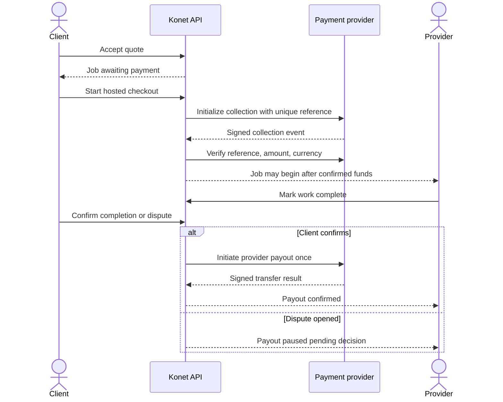

# Backend requirements: features, functions, and technical design

**Status:** planning document. The [project README](../README.md) describes what exists today. The first release is scoped to Nigerian universities and NGN. The product target is client-approved provider payout. Provider selection, merchant eligibility, and the legal money-holding arrangement remain open; listing a service here does not mean it is integrated.

## Product boundary

Konet serves verified university students who hire other students for services. The backend owns identity, verification decisions, catalog records, requests, quotes, jobs, messaging, reviews, disputes, and money records. The client may also be a provider. Administrative reviewers require a separate role and audit trail; the existing database does not yet include that role.

## Feature requirements

| ID | Feature | Required outcome | Existing foundation |
| --- | --- | --- | --- |
| F1 | Account and session | Register, log in, refresh, log out, reset password | Registration/login/refresh/logout exist; recovery incomplete |
| F2 | University directory | Manage universities, campuses, approved email domains | Read API and tables exist; admin management missing |
| F3 | Student verification | Confirm an applicant belongs to selected university; record evidence and decision | Submission table/API exist; review and proof validation missing |
| F4 | Provider onboarding | Verified student creates profile, submits identity/work evidence, receives approval | Profile creation and verification rows exist; evidence/review flow missing |
| F5 | Catalog and discovery | Publish active services and search by query, university, category, availability | Public read and service write APIs exist |
| F6 | Hiring | Request, quote, accept one quote, create job and conversation | API exists |
| F7 | Collaboration | Participant-only messages, notifications, job milestones | Persistence and endpoints exist; delivery strategy pending |
| F8 | Protected payment | Collect client payment, track funds, release or refund after decision | Payment records/interface exist; provider integration missing |
| F9 | Trust after work | Client review, dispute case, staff resolution | Review and dispute creation exist; resolution operations missing |
| F10 | Operations | Admin review queue, support tools, reconciliation, audit log, reporting | Proposed |

## Functional requirements and acceptance rules

### Identity and university verification

1. Registration must bind a user to an active university and valid campus. Email addresses must be unique and normalized. Passwords must be hashed with Argon2; refresh tokens must be hashed, rotated, and revocable.
2. A student chooses one of: approved university email, student ID with evidence, or manual document. An approved university email requires a one-time link or code delivered to that address. Domain membership alone is insufficient proof because addresses can be mistyped or controlled by someone else.
3. For institutions without usable student email, staff review a student ID or document. The system stores a private object key, not a public document URL; reviewers record approver, timestamp, reason, and decision. Limit retries and prevent duplicate active submissions.
4. Student status moves `unverified/not_submitted → pending → verified/rejected/requires_more_information`. Only an authoritative backend decision may set `verified`. Rejected applicants can resubmit under a documented policy.
5. Provider verification separately records identity, work, and optional business/CAC proof. The exact mandatory dimensions are a product decision. Only approved active providers may publish visible services.
6. Verification evidence needs retention and deletion rules, restricted access, malware/content checks, and an audit record. Never log raw student numbers or documents.

### Hiring and jobs

1. Only a verified client may request an active service from an active provider; self-hiring is rejected. A request captures service, description, optional amount range, location, and timing.
2. Only that provider may quote the request. A quote has an integer minor-unit amount, currency, scope, expiry, and optional delivery date. Expired or previously handled quotes cannot be accepted.
3. Acceptance is transactional and idempotent: exactly one accepted quote, job, payment record, and conversation for the request. Participant ownership is checked on every read and action.
4. Job transitions follow the API state machine: `awaiting_payment → scheduled → in_progress → awaiting_client_confirmation → completed`, with permitted cancel/dispute branches. Scheduling after payment requires verified payment evidence, not a browser redirect.
5. Messages are visible only to conversation participants. A completed job permits one client review. Disputes freeze release and require a documented resolution by an authorized operator.

### Payments and escrow-like protection

1. The amount, fee, and provider payout are calculated by the server in integer minor units. Client input cannot override them. Each charge, transfer, refund, and webhook has a unique reference/idempotency key.
2. The backend initiates checkout with a payment service provider. The browser is sent to the provider's hosted payment flow; Konet does not collect raw card numbers or CVV.
3. Confirm payment through a verified signed webhook and/or server-side transaction verification. Match reference, amount, currency, and job before changing the ledger. Webhook retries must be safe.
4. Mark money as held or protected only if the chosen provider and Konet's merchant setup actually support the required hold/settlement model. A database `held` flag alone does not create escrow.
5. Release requires a client confirmation or an explicit dispute decision. Transfer initiation and transfer success are distinct events. Failed transfers are retried/reconciled without creating a second payout. Refunds and chargebacks update the ledger and job/dispute state.
6. Finance operations need daily reconciliation against provider reports, payout records, fee records, alerts for mismatches, and a manual review path. Legal and provider terms for holding customer funds require specialist review before marketing this as **escrow**.

## Technical requirements

- Keep the NestJS modular monolith and PostgreSQL/Drizzle schema as the transactional core. Put verification, payment, transfer, and dispute actions behind services with explicit state machines.
- Expose versioned REST endpoints and OpenAPI. Validate DTOs, authenticate protected routes, enforce resource ownership, and use a separate admin role with least privilege.
- Add a `verification_challenges` table for one-time email codes/expiry and an `audit_events` table for decisions and money actions. Add payout/transfer records and immutable payment event records before real settlement. Schema details should be finalized with the selected provider's event model.
- Use a private S3-compatible object store for evidence and portfolio uploads through short-lived presigned URLs. Scan and inspect evidence before reviewers use it; restrict download URLs to authorized reviewers.
- Add an email delivery service for verification and recovery. Keep sending asynchronous, retry transient failures, and make links single-use and short-lived.
- Add a queue only for concrete asynchronous jobs (email, webhook processing, reconciliation). BullMQ with Redis is a reasonable proposal once workers are deployed; the current app intentionally has no queue.
- Add structured logs, correlation IDs, metrics, traces, error monitoring, backup/restore, migration checks, and secret management before launch. Avoid sensitive payloads in logs.
- Test state transitions, ownership, idempotency, webhook signature failures, and reconciliation. Run integration tests against PostgreSQL and the payment provider sandbox.

## Proposed service and library decisions

| Need | Proposal | Decision/constraint |
| --- | --- | --- |
| Payment collection and transfers | Paystack as a candidate for an NGN-first pilot | Verify merchant eligibility, settlement timing, transfer access, fees, and support for client-approved delayed payout. Split payments alone do not meet that requirement. |
| University email | One-time email link/code plus approved per-university domains | Must provide a manual review path for universities without reliable student domains. |
| Transactional email | Resend or another production email provider | Choose based on sending domain, deliverability, pricing, and data handling. |
| File storage | S3-compatible private bucket with `@aws-sdk/client-s3` and presigned URLs | Choose hosting region/provider and retention policy. |
| Background work | BullMQ + Redis when jobs are needed | Adds infrastructure and worker deployment; avoid until requirements justify it. |
| API contract | Nest Swagger/OpenAPI with generated TypeScript client | Prevent frontend/backend status and field drift. |
| Monitoring | Sentry plus structured Pino logs and OpenTelemetry | Choose hosting and data retention before integration. |

### Agreed payment target and remaining provider decision

The first release targets **client-approved provider payout** in NGN: the client pays before work, the provider completes the job, the client confirms satisfactory completion, and only then is provider payout initiated. A dispute must suspend release until an authorized resolution. The team still needs a provider and merchant arrangement that actually supports this sequence. Paystack supports hosted collection, signed webhooks, transaction verification, and transfers, but its split payments automatically allocate settlement; a split alone cannot enforce client approval before payout. Confirm the money flow, reserve/settlement timing, chargeback exposure, and legal terms with the chosen provider before presenting the flow as **escrow**. Until then, “protected payment workflow” is a design goal, not a live claim.

### Payment records and invariants to add

- `payment_attempts`: one row per provider collection attempt, with job, provider reference, amount, currency, status, and timestamps. A retry creates a new attempt without a second job.
- `payment_events`: immutable signed event ID, source, payload hash, event type, processing outcome, and received time. Enforce uniqueness on provider event ID and idempotent processing.
- `payout_accounts`: provider-owned recipient reference and verification state; avoid storing full bank details unless necessary.
- `payouts`: job/payment, recipient, gross amount, fee, net amount, provider transfer reference, state, approval source, and timestamps. Enforce at most one successful payout per job.
- `refunds` and `dispute_decisions`: amounts, references, actor, reason, state, and audit trail. Reconciliation must account for partial/failed outcomes.
- Persist balance-affecting state changes in transactions with explicit constraints. A client confirmation may authorize payout, but only a verified transfer result marks it paid. A chargeback or dispute blocks further automated release.

### Backend delivery order

1. Finish account recovery, university verification challenge/review, admin roles, evidence storage, and audit trail.
2. Define shared OpenAPI responses, pagination, money/status enums, and generate the frontend client.
3. Complete provider approval and catalog management, then connect authenticated requests, quotes, jobs, and messaging.
4. Select a provider after validating delayed payout capabilities and terms; implement sandbox collection, signed webhooks, reconciliation, and transfer/refund flows.
5. Add dispute resolution, operational alerts, backups, and end-to-end tests before a live payment pilot.

### References

- [Paystack payment acceptance](https://paystack.com/docs/payments/accept-payments/), [webhook verification](https://paystack.com/docs/payments/webhooks/), [transaction verification](https://paystack.com/docs/payments/verify-payments/), [transfers](https://paystack.com/docs/transfers/single-transfers/), [split payments](https://docs-v2.paystack.com/payments/split-payments/)
- [AWS S3 presigned uploads](https://docs.aws.amazon.com/AmazonS3/latest/userguide/PresignedUrlUploadObject.html)
