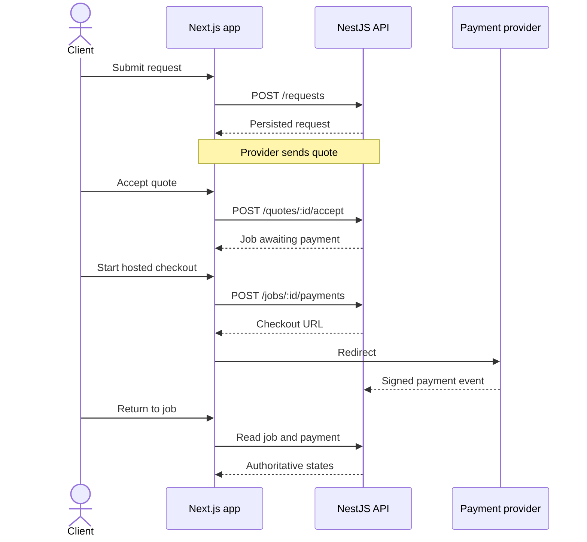

# Frontend requirements

**Status:** planning document. The [project README](../README.md) describes what is implemented today. This document defines the target web experience and proposed libraries; it does not claim those integrations are installed.

## Users and features

A visitor can explore Konet. A student account can be a client, a provider, or both. Operations staff will need a separate review interface. The API decides identity, verification, job, and payment state; the browser displays those decisions and submits requests.

| Area | User outcome | Current state |
| --- | --- | --- |
| Marketing | Understand services, trust, and fees | Pages exist |
| Account | Register, sign in, recover access | Demo forms; not connected to API |
| Student verification | Submit proof and track a real decision | Demo form immediately claims verification |
| Discovery | Search and compare active providers and services | Some public API reads; mock details remain |
| Provider onboarding | Draft profile, evidence, portfolio, services | Screens exist; actions mostly local |
| Hiring | Request, quote, accept, pay, follow job | Screens exist; actions mostly local |
| Communication | Message and receive notifications | Mock/local content |
| Trust | Review completed work and open disputes | Partial screens and API |
| Operations | Review evidence, decide disputes, reconcile payments | Not built |

## Functional requirements

### Account and verification

1. Registration collects full name, email, password, university, and campus. University and campus options come from the API. Sign-in creates a server-managed session and returns a user to their intended page.
2. Protected screens load the current account from the API. A browser-writable cookie must never prove student or provider status. Sign-out revokes the refresh session. Expired access tokens refresh once; repeated failure sends the user to sign-in.
3. Verification offers methods available at the selected university: a one-time code/link sent to an approved university email, or private evidence for staff review. Submitting shows `pending`. Only a backend decision shows `verified`; rejection and requests for more information explain the next step.
4. Password recovery uses a single-use, expiring link after the backend supports it. Errors must not reveal whether an account exists.

### Discovery and provider onboarding

1. Search active providers and services by query, category, university/campus, availability, and supported price filters. Keep filters in the URL. Empty states offer a way to broaden the search.
2. Provider details show active services, pricing type/currency, availability, verified dimensions, portfolio, and reputation. Missing data is labelled rather than replaced with demo values.
3. Onboarding saves a draft across profile, service, portfolio, evidence, and preview steps. Uploads show type/size limits, progress, failure, retry, and removal. Sensitive verification evidence never appears in a public portfolio.
4. Publishing is enabled only when the API confirms the student is verified and the provider profile is approved and active. A pending provider sees the approval state and cannot bypass it by editing browser state.

### Requests, jobs, and communication

1. A client chooses an active service and sends a description, optional budget, timing, and location. Success links to the persisted request returned by the API.
2. A provider can see requests addressed to them, discuss details, and send an amount, scope, expiry, and delivery date. Both sides see the authoritative quote status.
3. A client accepts only an unexpired quote for their request. The page follows the job ID returned by the API and displays job state separately from payment state.
4. The job workspace shows the current step, next action for the signed-in participant, conversation, payment state, and dispute option. Provider completion and client confirmation are separate actions.
5. Messages have sending, sent, and failed states. Retries must avoid duplicates. Notifications open their referenced resource and can be marked read. A client may review a completed job once.

### Checkout and payout

1. Show the agreed NGN amount and fees in naira, converting only at the display boundary; API requests use integer kobo. Show the provider payout amount when appropriate.
2. Checkout opens a hosted provider page. Konet must not collect card number or CVV. On return, query the API for payment status; a redirect or local UI state cannot mark the job funded.
3. The first release targets **client-approved provider payout**. Show collection, pending confirmation, protected funds, payout pending, payout complete, refund, and dispute states only when the API and payment provider support the corresponding money movement. Explain to both parties when client approval or dispute review is required.
4. A client confirmation requests payout; it does not imply payout succeeded. The UI displays payout success only after provider confirmation and backend reconciliation. Disputes suspend release until an authorized decision.

This payment flow is a target. The current API gateway is unconfigured. The frontend retains a card-details layout, but checkout still simulates success. Production card collection must use provider-hosted fields or client-side tokenization so raw card data never reaches Konet servers.

## Technical approach and proposed tools

| Need | Choice | Use |
| --- | --- | --- |
| Pages and rendering | Existing Next.js App Router, React, TypeScript | Server-render catalog; client components for forms and live actions |
| API contract | Generated TypeScript client from Nest Swagger OpenAPI | Align names, fields, status enums, and errors across projects |
| Forms | React Hook Form, Zod, `@hookform/resolvers` | Reusable client validation; API validation remains authoritative |
| Interactive server data | TanStack Query (installed) | Cache/invalidate authenticated jobs, messages, notifications; use ordinary server reads for simpler pages |
| HTTP and icons | Axios and Lucide React (installed) | Shared request boundary and consistent icon set |
| UI primitives | Shared custom select; Radix UI selectively if needed | Keyboard accessible menus and complex controls while retaining the current design |
| Uploads | Presigned private object storage URLs | Direct upload with progress; API controls authorization and confirms attachment |
| Live updates | Polling first | Add WebSockets only when product need and scale justify them |
| Tests | Playwright; Vitest and React Testing Library | Full hiring journeys and complex component behavior |

The rows marked installed are in the frontend package. Other choices remain proposed; install them when their features are implemented. Avoid adding a global state library for server records already owned by the API or query cache.

## Session and contract decisions

The existing API returns a short-lived access token and sets an HttpOnly refresh cookie under `/api/v1/auth`. Before wiring the frontend, choose one browser-to-API pattern. A recommended pattern is a same-origin Next.js server session boundary: browser actions call Next handlers, which call the API and keep tokens out of browser JavaScript. This requires coordinating API cookie scope, refresh behavior, and CSRF protection. Direct browser calls with an in-memory access token are an alternative but require different CORS and reload handling. Use one pattern consistently.

The API contract must define error shape, pagination, UTC date/time formatting, minor-unit money, and status enums. The demo frontend `JobStatus` values (`funded`, `delivered`, `released`) differ from the API job states (`awaiting_payment`, `scheduled`, `in_progress`, `awaiting_client_confirmation`, `completed`, `disputed`, `cancelled`). Payment and payout states require their own fields. Never infer them from URL query parameters.

## Acceptance and delivery order

- Reload preserves persisted requests, quotes, messages, and jobs. No action reports success before the API confirms it.
- Student submission remains pending until backend approval; provider publishing respects backend approval.
- Checkout never stores card data. A client confirmation does not show payout success until it is confirmed.
- Every critical screen supports loading, empty, error, retry, and permission-denied states, on mobile and desktop.
- Forms are keyboard usable, have labels and field-linked errors, and announce asynchronous results.
- End-to-end tests cover account access, verification, hiring, checkout handoff, client confirmation, and disputes against a test API.

Implement in this order: (1) generated contract and session; (2) catalog reads and shared types; (3) verification and provider onboarding; (4) requests, quotes, jobs, messaging; (5) hosted payment and payout states; (6) reviews, disputes, earnings, and operations.
